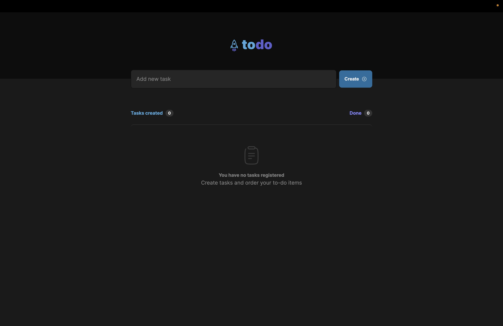

# ToDo List - Web

## The App
This is a to-do list that lets you create tasks, mark or unmark them as finished or delete them. 
There are counters on the top of the list with the number of tasks to-do and already done tasks.

### Previews

  
  

### Techs
1. React
2. Typescript
3. useState Hook

### Steps
1. Clone this repository;
2. Run your preferred command to install dependencies:
- `npm install`
- `yarn install` 
- `pnpm install` 
3. Run the app with: 
- `npm run dev`
- `yarn dev` 
- `pnpm run dev` 